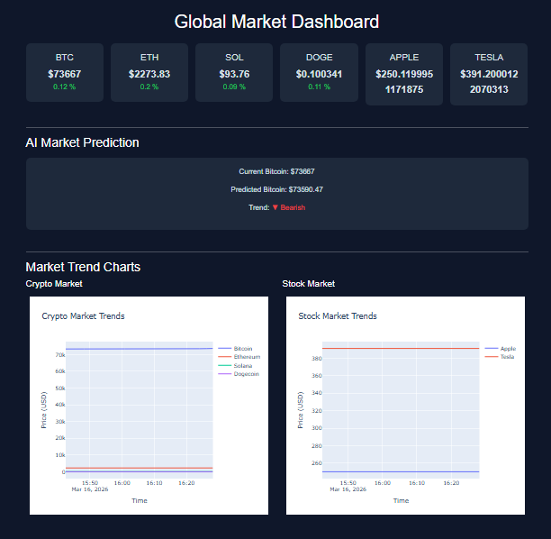

# 📊 AI Market Intelligence Dashboard

A real-time financial analytics dashboard that tracks live cryptocurrency and stock prices, visualizes market trends, and predicts Bitcoin price direction using machine learning.

🔗 **[Live Demo](https://market-dashboard-chpw.onrender.com/)**

---

## 📸 Preview



---

## 🚀 Features

- Live crypto prices — BTC, ETH, SOL, DOGE
- Live stock prices — Apple, Tesla
- Percentage change indicators (green/red)
- Interactive Plotly charts for crypto and stock trends
- AI-powered Bitcoin price prediction (Linear Regression)
- Auto-refreshes every 30 seconds
- Automated data collection every 2 minutes via scheduler
- Professional dark-themed UI

---

## 🧠 Tech Stack

| Layer | Technology |
|---|---|
| Backend | Python, Flask |
| Data Collection | Requests, YFinance |
| Data Storage | CSV (Pandas) |
| Analysis & ML | Pandas, Scikit-learn |
| Visualization | Plotly |
| Automation | Schedule |
| Frontend | HTML, CSS, Bootstrap 5 |
| Deployment | Render |

---

## 🏗 System Architecture

```
Market APIs (CoinGecko + YFinance)
        ↓
   Data Fetcher
        ↓
  CSV Storage (Pandas)
        ↓
  Analysis + ML Prediction
        ↓
  Plotly Chart Generation
        ↓
   Flask Dashboard
        ↓
   Web Browser
```

---

## 📂 Project Structure

```
market_dashboard/
│
├── app.py                  # Flask routes and dashboard logic
├── scheduler.py            # Automated data collection every 2 mins
├── requirements.txt
├── Procfile                # For deployment on Render
│
├── data/
│   └── market_data.csv     # Collected market data
│
├── modules/
│   ├── data_fetcher.py     # Fetches live prices from APIs
│   ├── analysis.py         # Processes data and generates charts
│   └── prediction.py       # Linear Regression BTC prediction
│
├── templates/
│   └── dashboard.html      # Main dashboard UI
│
└── static/
    ├── crypto_chart.html   # Generated Plotly crypto chart
    └── stock_chart.html    # Generated Plotly stock chart
```

---

## ⚙ Local Setup

```bash
git clone https://github.com/pranavgarg13-star/market-dashboard.git
cd market-dashboard
pip install -r requirements.txt
```

Start data collection:
```bash
python scheduler.py
```

Run the dashboard:
```bash
python app.py
```

Open in browser: `http://127.0.0.1:5000`

---

## 📈 AI Prediction

Uses a **Linear Regression model** trained on historical price data to predict the next Bitcoin price and display trend direction.

> ⚠️ Note: Linear Regression is intentionally simple here. It predicts a straight-line trend and is not suitable for real trading decisions. Future versions will explore time-series models like LSTM.

---

## ⚠️ Known Limitations

- CSV storage resets on Render free tier restarts (ephemeral filesystem)
- Linear Regression is a weak model for volatile assets like crypto
- Stock prices via YFinance reflect end-of-day data, not real-time tick data
- CoinGecko free API has rate limits — heavy usage may cause fetch failures

---

## 📌 Future Improvements

- [ ] Replace CSV with PostgreSQL for persistent storage
- [ ] Upgrade prediction model to LSTM or Prophet
- [ ] Add Buy/Sell signal generation
- [ ] Add more assets and portfolio tracking
- [ ] Add volatility indicators

---

## 👨‍💻 Author

**Pranav Garg**  
[GitHub](https://github.com/pranavgarg13-star)

---

## 📜 License

This project is for educational and learning purposes.